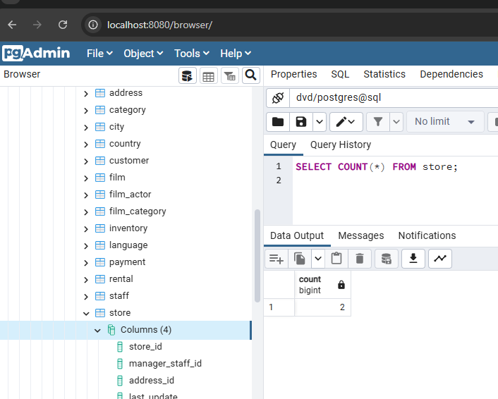
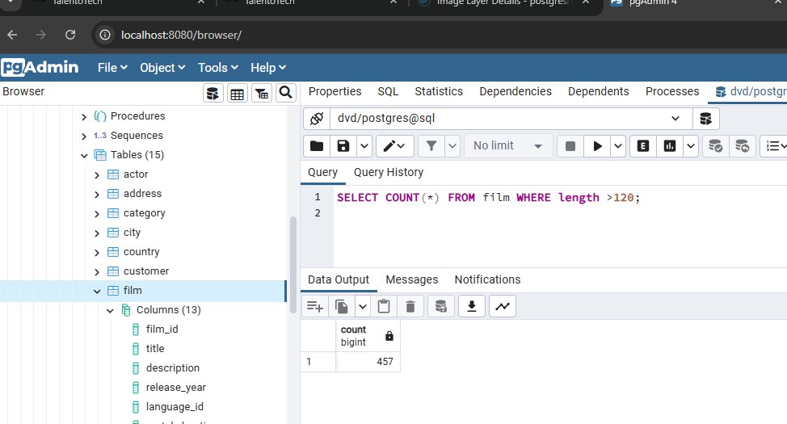
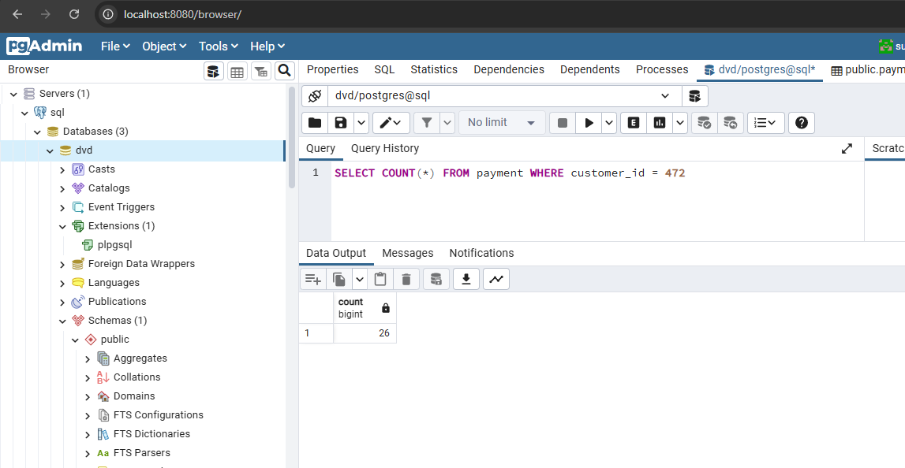
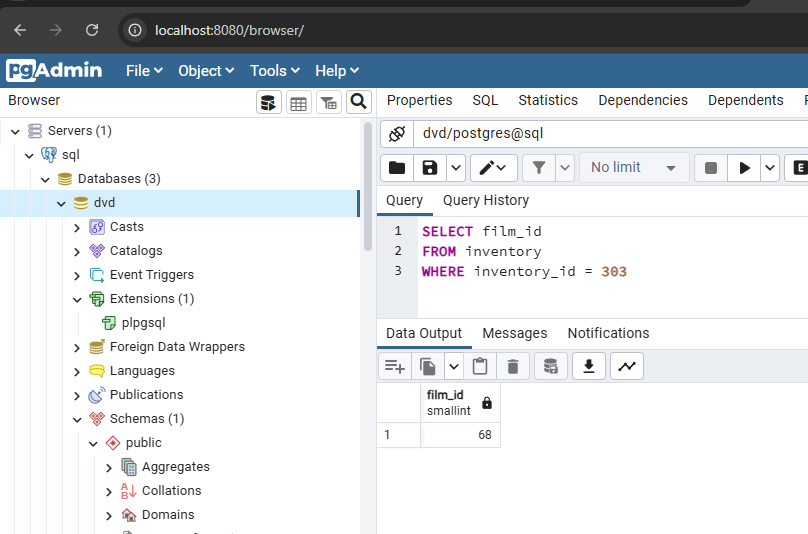
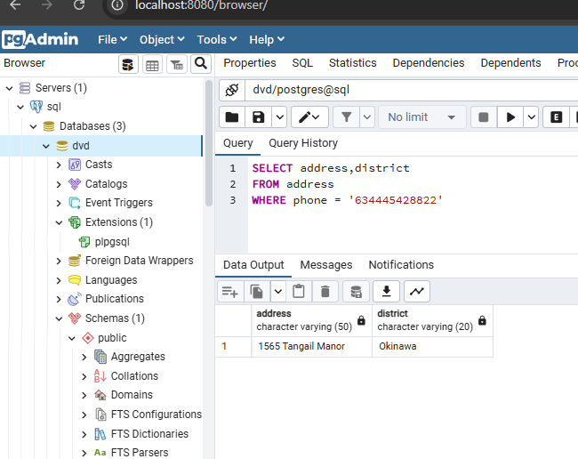

Ejercicios
A partir de la base de datos suministrada y mediante DQL. Hacer las consultas (queries) necesarias para responder las siguientes preguntas:

¿Cuántas tiendas (store) hay en total?

¿Cuántas películas (film) tienen una duración de más de 120 minutos?

¿Cuántos pagos realizó el cliente (customer) con el ID 472?

¿Cuál es el ID de la película (film) que tiene un ID de inventario (inventory) 303?

¿Cuál es la dirección (address) y distrito (district) de la persona cuyo teléfono es 634445428822?

