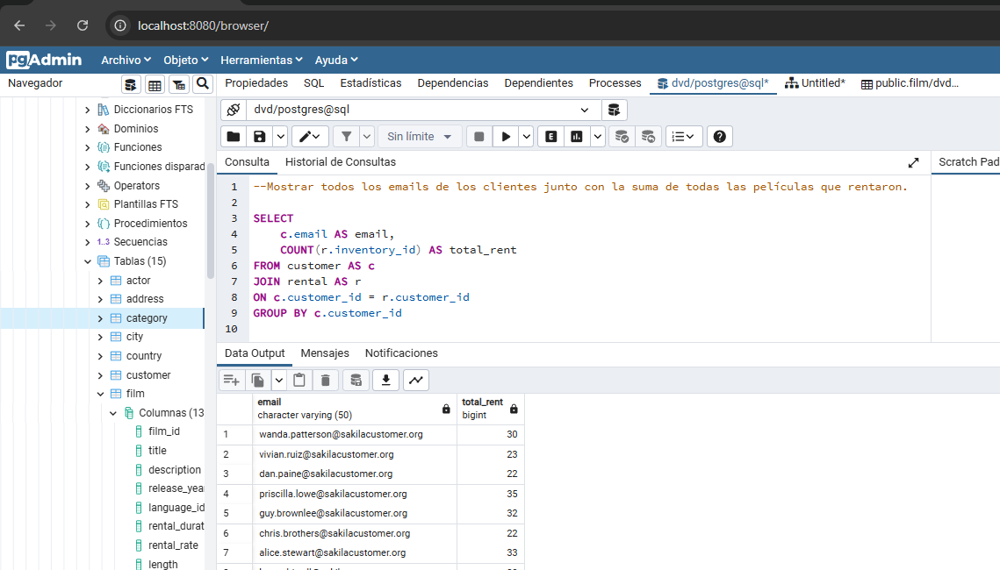

Ejercicios
A partir de la base de datos suministrada y mediante DQL. Hacer las siguientes consultas (queries):

Contar cuántas películas empiezan con la letra S.

Sumar la duración en minutos de todas las películas clasificadas para PG-13.

Mostrar todos los emails de los clientes junto con la suma de todas las películas que rentaron.

Mostrar el número de teléfono de la dirección que tiene el código postal más grande.

Mostrar la dirección, el distrito y el nombre de la ciudad del primer cliente inactivo.

